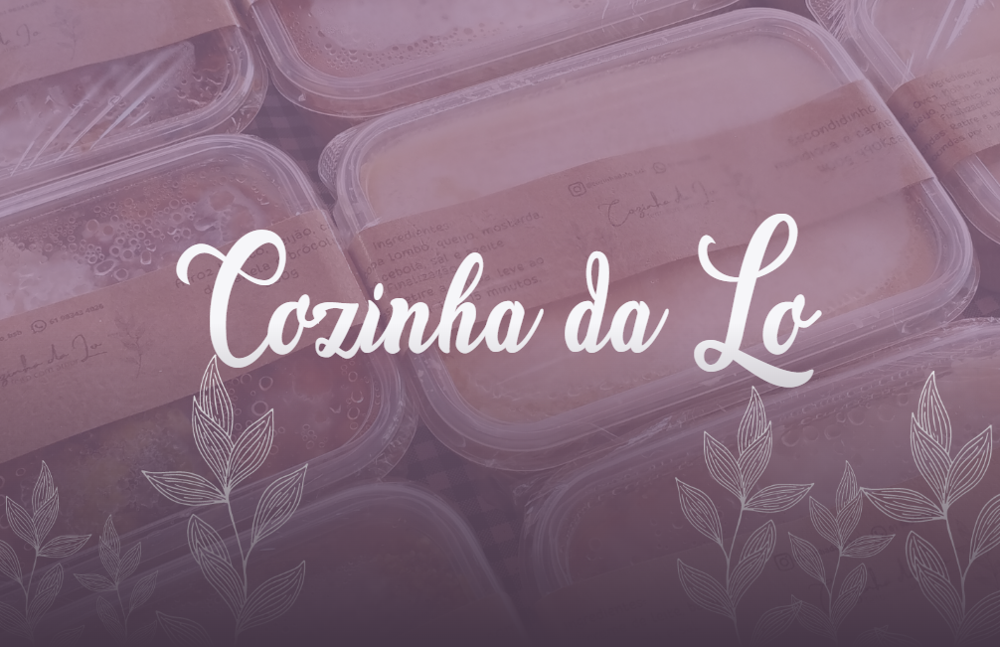
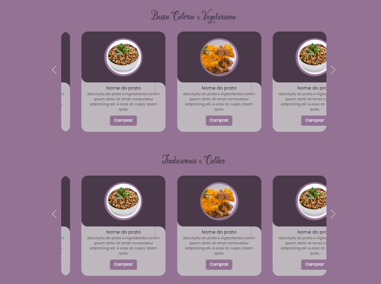

  <h1>Sejam muito bem vindos!!</h1>
  <strong>Cozinha da Lo</strong>
  <h6>Feito com ❤️ by DebsLorena</h6>

 

## Cozinha da Lo, page com parallax e cards em carrosel

    
    

### 🎨 Frontend

*  **Html**: com Visual Studio Code 
*  **CSS**: com Visual Studio Code

## 🙌 Quer Contribuir?

Estamos abertos a todos os tipos de contribuições. Se você quiser:
* 🤔 Sugira um recurso
* 🐛 Informar um problema
* 📖 Melhore a documentação
* 👨‍💻 Contribua com o código

Você é mais que bem vindo. 

    <h6>Feito com ❤️ by DebsLorena</h6>
    <a href="https://www.linkedin.com/in/loredebs/"><strong>Linkedin</strong></a> 
    <a href="https://www.instagram.com/debslorena/"><strong>Instagram</strong></a>

